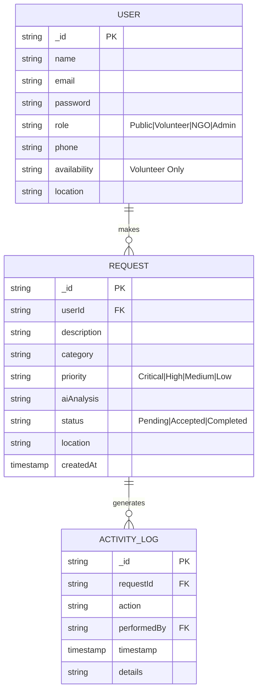
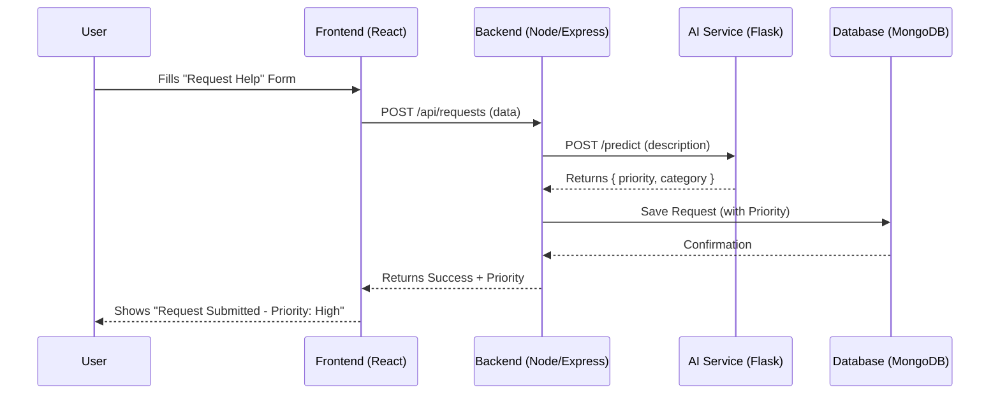

# System Architecture & Database Schema

## 1. Entity Relationship (ER) Diagram

```mermaid
erDiagram
    USER ||--o{ REQUEST : makes
    USER {
        string _id PK
        string name
        string email
        string password
        string role "Public|Volunteer|NGO|Admin"
        string phone
        string availability "Volunteer Only"
        string location
    }

    REQUEST ||--o{ ACTIVITY_LOG : generates
    REQUEST {
        string _id PK
        string userId FK
        string description
        string category
        string priority "Critical|High|Medium|Low"
        string aiAnalysis
        string status "Pending|Accepted|Completed"
        string location
        timestamp createdAt
    }

    ACTIVITY_LOG {
        string _id PK
        string requestId FK
        string action
        string performedBy FK
        timestamp timestamp
        string details
    }
```

## 2. System Flowchart (User -> Frontend -> Backend -> AI -> Database)

```mermaid
sequenceDiagram
    participant User
    participant Frontend as Frontend (React)
    participant Backend as Backend (Node/Express)
    participant AI as AI Service (Flask)
    participant DB as Database (MongoDB)

    User->>Frontend: Fills "Request Help" Form
    Frontend->>Backend: POST /api/requests (data)
    Backend->>AI: POST /predict (description)
    AI-->>Backend: Returns { priority, category }
    Backend->>DB: Save Request (with Priority)
    DB-->>Backend: Confirmation
    Backend-->>Frontend: Returns Success + Priority
    Frontend-->>User: Shows "Request Submitted - Priority: High"
```
