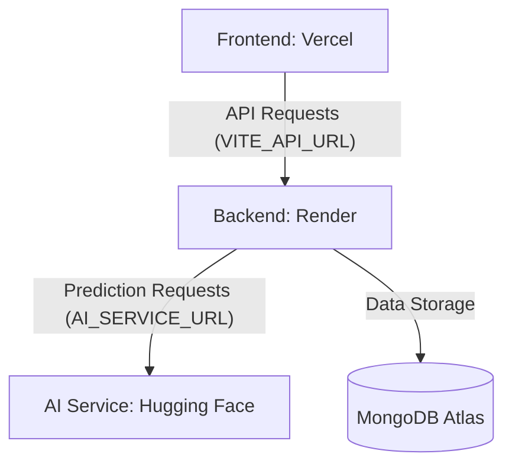

# Deployment Guide: Transparent Public Welfare Platform

This guide outlines the steps to deploy the three main components of the platform: AI Service (Hugging Face), Backend API (Render), and Frontend Client (Vercel).

## 1. AI Service (Hugging Face Spaces)
The AI service is containerized using Docker and is ready for Hugging Face.

### Steps:
1.  **Create Space**: Go to [Hugging Face Spaces](https://huggingface.co/new-space).
2.  **Name**: Give it a name (e.g., `welfare-ai-service`).
3.  **SDK**: Select **Docker**.
4.  **Hardware**: The "CPU Basic" tier is sufficient.
5.  **Repository**:
    - If you are using Git, push the contents of the `ai-server/` folder to the Space repository.
    - Alternatively, upload the files (`app.py`, `model.py`, `Dockerfile`, `requirements.txt`) directly via the HF web interface.
6.  **URL**: Once built, your AI URL will look like: `https://<user>-<space-name>.hf.space`.

> [!IMPORTANT]
> Note down the URL. You will need it for the Backend deployment.

---

## 2. Backend API (Render)
Render is ideal for hosting the Express/Node.js backend.

### Steps:
1.  **Create Web Service**: Go to [Render Dashboard](https://dashboard.render.com/) and click **New +** > **Web Service**.
2.  **Connect Repo**: Link your GitHub/GitLab repository.
3.  **Settings**:
    - **Name**: `welfare-backend`
    - **Root Directory**: `server`
    - **Runtime**: `Node`
    - **Build Command**: `npm install`
    - **Start Command**: `npm start`
4.  **Environment Variables**: Click "Advanced" and add:
    - `MONGO_URI`: Your MongoDB Atlas connection string.
    - `JWT_SECRET`: A secure random string.
    - `NODE_ENV`: `production`
    - `AI_SERVICE_URL`: `https://<user>-<space-name>.hf.space` (URL from Step 1).

---

## 3. Frontend Client (Vercel)
Vercel provides the fastest deployment for Vite/React applications.

### Steps:
1.  **Create Project**: Go to [Vercel Dashboard](https://vercel.com/new).
2.  **Import Repo**: Link your repository.
3.  **Settings**:
    - **Framework Preset**: `Vite`
    - **Root Directory**: `client`
4.  **Environment Variables**:
    - Add `VITE_API_URL`: `https://<your-render-app-name>.onrender.com` (URL from Step 2).
5.  **Deploy**: Click **Deploy**.

---

## Deployment Logic Flow

## Post-Deployment Checklist
- [ ] **CORS**: Ensure the Render backend allows requests from your Vercel URL (currently configured to allow all origins).
- [ ] **Health Check**: Visit `https://<your-render-url>/` to see "Disaster Welfare Platform API is running...".
- [ ] **AI Warmup**: The first AI request might be slow as the model loads in the HF Space.
